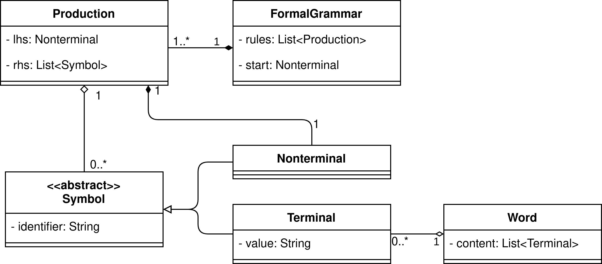

= Studienarbeit: Neuentwicklung eines Tools zur Veranschaulichung von formalen Grammatiken in der Lehre
Felix Kirscht, Patrick Sewell
:revealjs_hash: true
:revealjs_width: 1920
:revealjs_height: 1080
:revealjs_theme: night
:revealjs_controls: false
:revealjs_progress: false
:revealjs_slideNumber: c/t
:revealjs_totalTime: 1800
:revealjs_transition: slide
:revealjs_pdfseparatefragments: false

Betreut von Prof. Dr. Axel Hoff

== Inhalt

* Motivation und Zielstellung
* Anforderungen und Stakeholder
* Theoretische Grundlagen
* Softwarearchitektur und -design
* Technologieentscheidungen
* Demonstration der Anwendung
* Reflexion und Ausblick

[.columns]
== Motivation und Zielstellung

[.column]
.Motivation
Formale sprachen sind schwer zu greifen

[.column]
.Ziel
SW Tool zur Unterstützung in der Lehre

== Anforderungen und Stakeholder

[.columns]
=== Stakeholder

[.column]
.Primäre
* Mitarbeitende der DHBW
* Lehrende an der DHBW
* Entwicklungsteam

[.column]
.Sekundäre
* Partnerunternehmen
* DHBW
* Zukünftige Entwicklungsteams
* Studierende

=== Anforderungen

.Grundlegende Funktionalität
* Grammatik anlegen und verwalten
* Worte mit CYK testen
* Visualisierung
** CYK
** Ableitungsbaum

=== Anforderungen

.Umgebung
* Geringe Hardwareanforderungen
* Unterstützung gängiger Betriebssysteme

.Zuverlässigkeit
* Keine Beeinträchtigung des Vorlesungsbetriebs
* Gute User Experience, intuitive Bedienung

=== Anforderungen

.Zukünftiges Potential
* Wiederverwendbarkeit
* Erweiterbarkeit
* Wartbarkeit
* Dokumentation

== Theoretische Grundlagen

=== Begriffe

(Formale) Sprache::
  Menge von Wörtern über einem Alphabet
Formale Grammatik::
  Menge von Regeln zur Erzeugung formaler Sprachen

=== Begriffe

Terminale (T)::
  Folge von Terminalen bildet ein Wort
Nichtterminal (N)::
  Symbole aus denen (Nicht)Terminal(e) abgeleitet werden können +
  Startsymbol der Grammatik ist ein Nichtterminal

=== Kontextfreie Grammatiken

* Hier: Beschränkung auf kontextfreie (Chomsky-2) Grammatiken
* Regeln der Form X → α
** X ∈ N
** α ∈ (N ∪ T)*

=== CYK

.Chomsky Normalform (CNF)
* Regeln der Form
** S → ε +
X → YZ +
X → a
** S, X, Y, Z ∈ N; a ∈ T +
ε: Leeres Wort; S: Startsymbol
* Chomsky-2 Grammatiken können in die CNF transformiert werden

=== CYK

.Grundsätzliche Arbeitsweise
* Betrachtung der möglichen Kombinationen von Teilworten
* Ergebnis: CYK Dreiecks-Matrix
* Wortproblem: Entscheidung durch Gegenwart des Startsymbols in letzter Zelle
* Ableitungsbäume: Rückverfolgung der Produktionen vom Startsymbol ausgehend

[transition="slide-in fade-out"]
=== CYK

[transition=fade]
=== CYK

[transition="fade-in slide-out"]
=== CYK

image:cyk_veranschaulichung_3.png[height=720]

== Softwarearchitektur und -design

=== Überblick

=== Engine

image:studienarbeit_engine_design.png[]

=== Visualisierung

=== CLI

[transition="slide-in fade-out"]
=== Datenmodell

[transition="fade-in slide-out"]
=== Datenmodell

[transition="slide-in fade-out"]
=== Algorithmik

[transition="fade-in slide-out"]
=== Algorithmik

[transition="slide-in fade-out"]
=== GUI

[transition=fade]
=== GUI

[transition="fade-in slide-out"]
=== GUI

image:design_gui_3.png[height=720]

== Technologieentscheidungen

=== Programmiersprache

.C++
* Entwicklererfahrung vorhanden
* Verbreitet
* Prinzipiell hochperformant
* Unterstützung von OO-Programmierung
* Portabler Quellcode möglich

=== Buildsystem

.CMake
* Plattformunabhängig
* Weitverbreitet bei OSS
** Einbinden von Abhängigkeiten
** IDE Integration

=== GUI

.wxWidgets
* Plattformunabhängig
* Entwicklererfahrung vorhanden
* Verfügbarkeit von RAD Tools
//* Verwendung nativer GUI-Elemente

== Demonstration der Anwendung

== Reflexion und Ausblick

=== Reflexion

.Performance CYK
* Keine optimale Implementierung
* Overhead für Visualisierung
** ~30% für Generierung der Syntaxbäume
** ~60% für Handling der CYKLinks
** ~20% für Speichern der einzelnen CYK Schritte

=== Reflexion

.Technologie
* Einschränkungen der Implementierung
** Dateien
** Länge von Regeln und Wörtern
* Wiederverwendbarkeit
* Auf Windows momentan kleine Darstellungsprobleme

=== Ausblick

.Funktionalität
* Unterstützte Algorithmen
* CLI
** Textuelle Grammatikeingabe
** Automatisiert verarbeitbare Ausgabe

=== Ausblick

.Bedienung (GUI)
* Verfeinern des Bedienkonzepts
* Visuelle Verbesserungen
* Konfiguration

== Vielen Dank für Ihre Aufmerksamkeit!

[.stretch]
Gibt es noch Fragen?

// vim:spelllang=de

